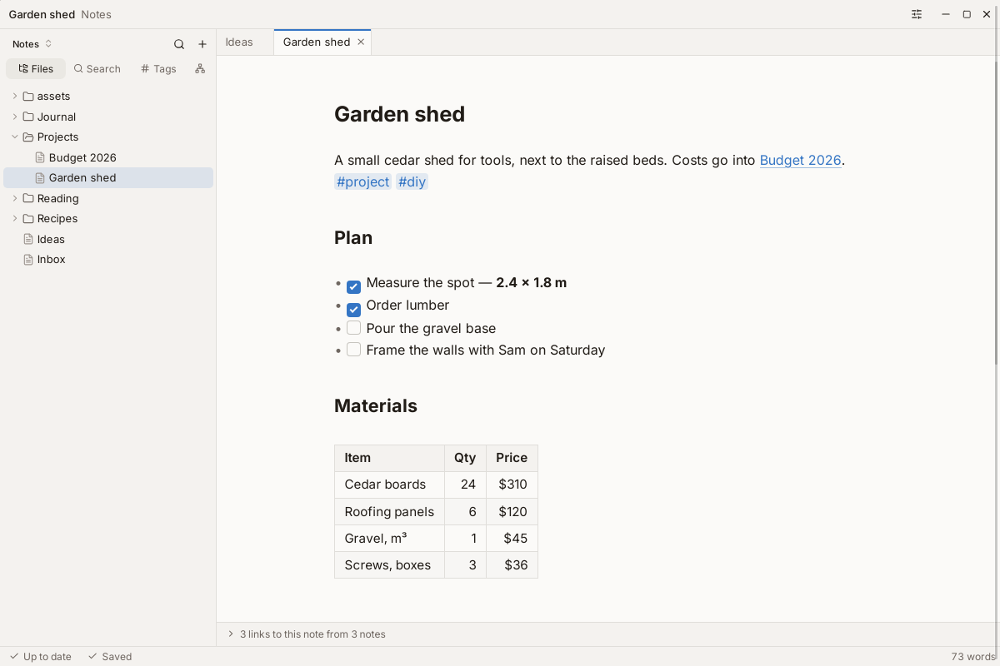
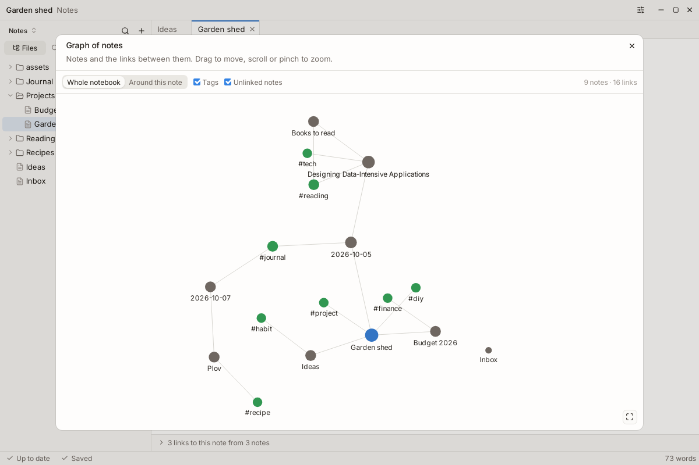
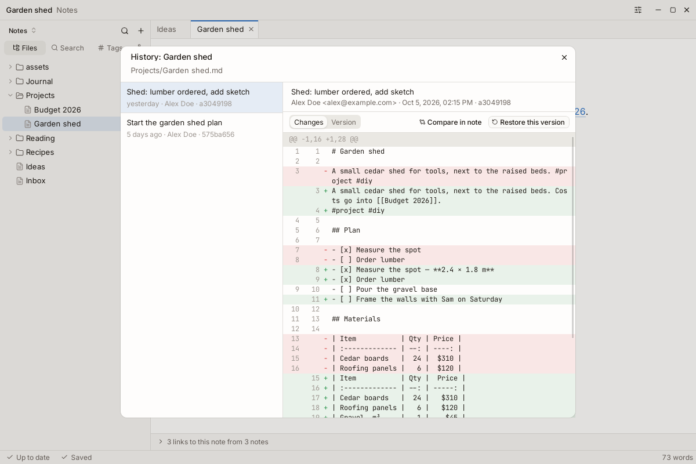
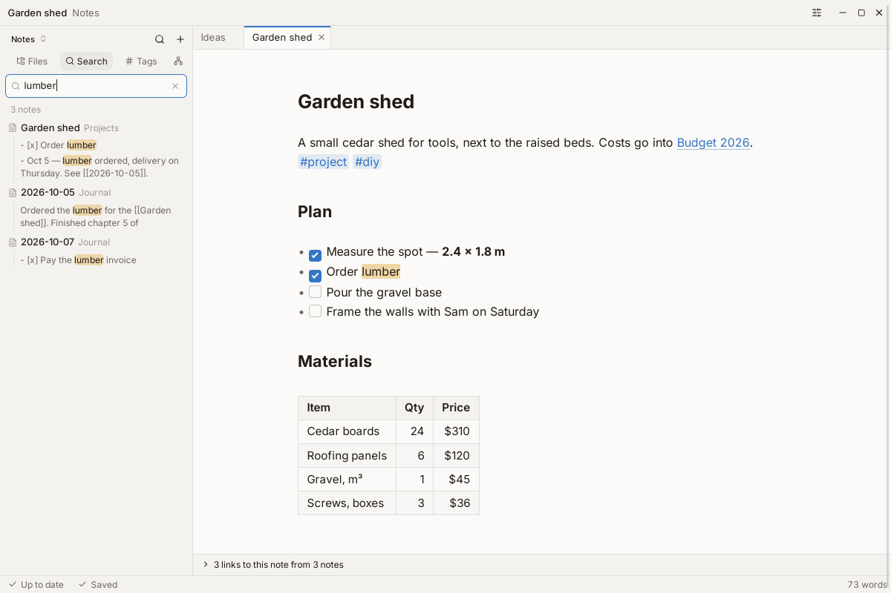
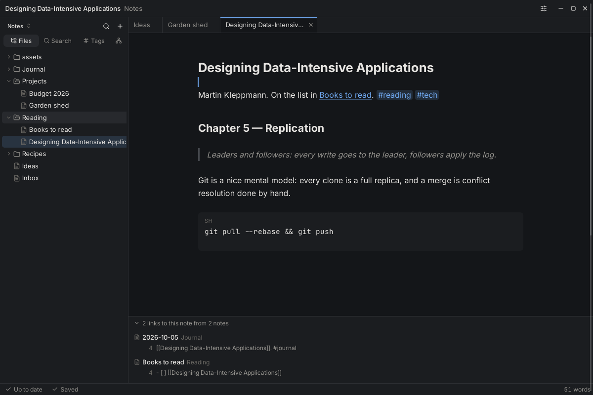
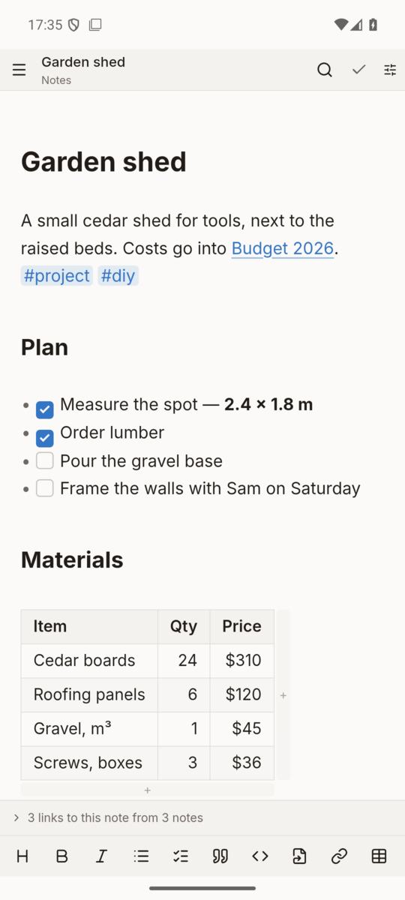
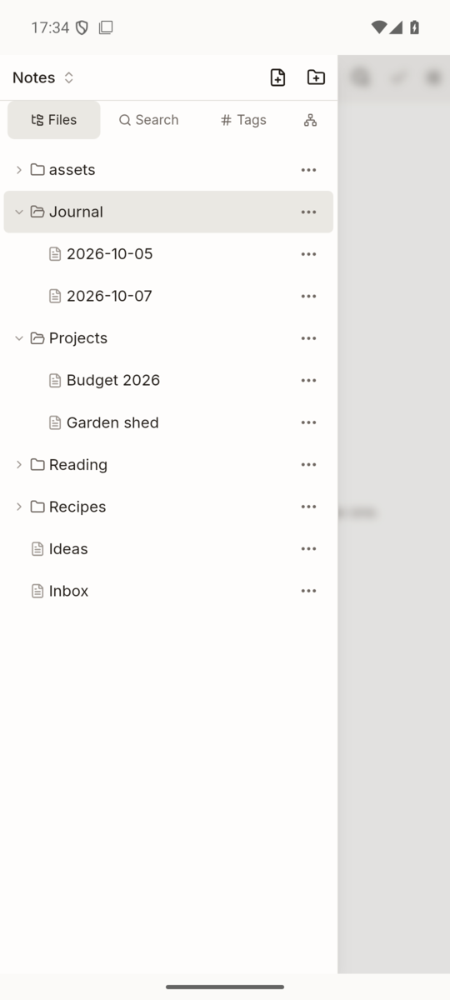

# git-notes

Markdown notes for Linux, Windows and Android where every notebook is a plain Git repository.
Write in a live-preview editor; git-notes commits and syncs in the background through any git
host — GitHub, Gitea, GitLab or your own SSH server. No account, no server of ours, no lock-in:
your notes are `.md` files with full history.

[](https://github.com/ylkhn1/git-notes/releases/latest)
[](https://github.com/ylkhn1/git-notes/actions/workflows/ci.yml)



## Features

- **Live preview editor.** Headings, lists, checkboxes, quotes, code and tables render as you
  type; the Markdown shows only on the line you edit. Tables are edited cell by cell.
- **Sync through git.** Changes are committed and pushed 30 s after you stop typing, pulled
  when the app comes back to the foreground and every 15 minutes. Works offline and catches up
  later. When two devices edit the same lines, both versions are kept and shown side by side.
- **Links and backlinks.** `[[Wiki links]]` with completion, links to headings, a backlinks
  strip under every note; renaming or moving a note updates the links to it.
- **Tags.** `#tag`, `#nested/tag` or `tags:` in YAML front matter, with a tag tree in the
  sidebar.
- **Search** across the notebook: words, `"exact phrase"`, `tag:` and `path:`.
- **Graph** of notes, links and tags, for the whole notebook or around the open note.
- **History.** Every version of a note with its diff, changed lines marked in the editor
  margin, deleted files, and _Restore this version_.
- **Attachments.** Paste or drop images and files; images are shown inline and open full size.
- **Command palette** (`Ctrl+K`), quick switcher (`Ctrl+P`), light and dark themes, English and
  Russian interface.
- **Android app** with the same notebooks, a formatting toolbar, and a share target: text shared
  from any app becomes a new note.
- **Updates itself** from GitHub Releases on desktop and Android.
- **Secrets stay in the OS.** One SSH key per device (generated in the app) or HTTPS tokens,
  kept in the system keyring / Android Keystore.

## Screenshots

| Graph of notes and tags                           | History with diff and restore                         |
| ------------------------------------------------- | ----------------------------------------------------- |
|  |  |
| **Search across notes**                           | **Dark theme and backlinks**                          |
|     |       |

<p align="center">
  
  &nbsp;&nbsp;
  
</p>

## Install

Download the latest build from
[GitHub Releases](https://github.com/ylkhn1/git-notes/releases/latest):

| Platform | File                                                                       |
| -------- | -------------------------------------------------------------------------- |
| Linux    | `.AppImage` (any distro), `.deb` (Debian/Ubuntu), `.rpm` (Fedora/openSUSE) |
| Windows  | `-setup.exe` installer or `.msi`                                           |
| Android  | `git-notes_<version>_android.apk` (Android 8.0+)                           |

On Android, allow your browser to install apps when asked. After that git-notes updates itself
on every platform: a banner offers each new release with its notes; on Android the first
update asks once to let git-notes install apps. Checking can be turned off in
_Settings → About_.

## Sync between devices

Every notebook is an ordinary git repository, so any git host works: GitHub, Gitea, GitLab or
a bare repository on an SSH server. Each device has its own SSH key (generated inside the app,
stored in the OS credential store) or an HTTPS token. Walk-through with GitHub:

1. **Create an empty private repository** — no README, no `.gitignore`, so the first sync does
   not have to merge two histories:

   ```sh
   gh repo create notes --private
   ```

2. **First device (the one that already has notes).**
   - Settings (`Ctrl+,`) → **Credentials** → _SSH key_ → **Generate key**. Copy the public key
     and add it to GitHub under _Settings → SSH and GPG keys_ (one key per device, name it after
     the device). The private key never leaves the credential store.
   - Open the notebook, click the sync status at the bottom left (the cloud icon on Android) →
     **Remote & git setup…** → _Remote URL_ `git@github.com:<you>/notes.git` → **Save**.
   - **Sync now** (`Ctrl+Shift+S`). The first run commits what is in the folder and pushes
     `main`. GitHub's host key is trusted on first use and listed under Credentials → _Known SSH
     hosts_; compare the fingerprint with the one GitHub publishes.

3. **Every other device.** Install the app, finish the first-run questions, then open the
   appearance menu (top right) → **All settings…** → **Credentials** → **Generate key** and add
   that key to GitHub too. Back on the first screen choose **Clone an existing repository**
   (**Clone repository** on the notebook list) and paste the same URL. On Android the clone
   lives in the app's private storage.

4. **That is all.** Changes are committed and pushed 30 s after you stop typing, pulled when
   the app regains focus and every 15 min while it is open; _Sync now_ forces a run. If two
   devices edit the same lines, both versions are kept and a banner offers a side-by-side
   view to pick one. Everything is tunable in Settings → _Sync & identity_.

**HTTPS instead of SSH:** create a fine-grained personal access token with _Contents:
read and write_ on the notes repository, save it under Credentials → _HTTPS tokens_ for host
`github.com`, and use `https://github.com/<you>/notes.git` as the remote URL. Cloning a public
repository needs no credentials at all.

## Writing notes

**Links.** Type `[[` to link to another note: a list of notes appears as you type.
`[[Note#Heading]]` links to a heading, `[[Note|text]]` shows `text` instead of the name. Click
a link to open it (Ctrl-click while editing that line); a link to a note that does not exist
yet creates it. Renaming or moving a note updates the links to it.

**Tags.** Write `#tag` or `#nested/tag` anywhere in the text, or list them in front matter
(`tags: [a, b]`). Click a tag to search for it; the _Tags_ tab in the sidebar shows every tag
with its number of notes.

**Search** (`Ctrl+Shift+F`) finds notes containing every word. `"exact phrase"` matches a
phrase, `tag:project` notes with a tag (nested tags included), `path:journal` notes whose path
contains the text.

**Tables** are ordinary GitHub-flavoured Markdown. _Insert table_ (right-click menu, command
palette, or the table button on a phone) adds one. Click a cell to edit it; **Tab** /
**Shift+Tab** go to the next / previous cell and **Enter** to the cell below, and the "+" bars
on the right and bottom edges add a column or a row. Right-click adds and deletes rows and
columns and sets a column's alignment. Inside a table write `[[Note\|text]]` for a link with
its own text, because a bare `|` starts a new cell.

**Attachments.** Paste, drop or pick any file; it is copied to `assets/` in the notebook and
linked from the note (`` for images). Dragging a note from the file tree into the editor
inserts a link to it.

**History.** _Note history_ and _Notebook history_ (in the sync menu and the command palette)
list every commit with its diff; _Restore this version_ brings a note back, and Ctrl+Z undoes
that. The editor margin marks lines changed since the last commit.

## Keyboard shortcuts

| Action              | Shortcut       |
| ------------------- | -------------- |
| Command palette     | `Ctrl+K`       |
| Open a note by name | `Ctrl+P`       |
| Search in all notes | `Ctrl+Shift+F` |
| Find in this note   | `Ctrl+F`       |
| New note            | `Ctrl+N`       |
| Rename note         | `F2`           |
| Sync now            | `Ctrl+Shift+S` |
| Settings            | `Ctrl+,`       |
| All shortcuts       | `Ctrl+/`       |

Shortcuts also work with a non-Latin keyboard layout.

## Development

- **Shell:** [Tauri 2](https://v2.tauri.app) (desktop + Android from one codebase)
- **Frontend:** React 19 + TypeScript + Vite, Tailwind CSS v4, shadcn/ui, lucide-react, zustand
- **Editor:** CodeMirror 6 with Obsidian-style live preview
- **Core:** Rust — `git2` (vendored libgit2 + OpenSSL), `ssh-key`, `keyring`, `tokio`, `tracing`,
  `thiserror`
- **Bindings:** [`tauri-specta`](https://github.com/specta-rs/tauri-specta) generates
  `src/lib/bindings.ts`

See [docs/dev-setup.md](docs/dev-setup.md) for toolchain installation (Linux, Windows, Android)
and [docs/release.md](docs/release.md) for releases and the updater.

```sh
pnpm install
pnpm tauri dev            # desktop
pnpm tauri android dev    # Android device / emulator
```

Checks (the same as CI):

```sh
pnpm lint && pnpm typecheck && pnpm format:check && pnpm test
cd src-tauri; and cargo fmt --check; and cargo clippy --all-targets -- -D warnings; and cargo test
```

UI primitives come from shadcn/ui (style `radix-nova`, aliases in `components.json`):
`pnpm dlx shadcn@latest add popover` puts a component in `src/ui/`. Design tokens live in
`src/app/styles.css`, where the shadcn variable names are mapped onto them.

```
src/                   React app
  app/                 entry, global styles, design tokens
  features/            feature slices (editor, tree, sync, history, search, graph, updates, …)
  ui/                  shadcn/ui primitives
  lib/                 bindings.ts (generated — do not edit), helpers with tests
  lib/i18n/            UI languages: t(), useT(), rich(); messages/<namespace>.ts (en + ru)
src-tauri/
  src/commands/        thin #[tauri::command] layer
  src/notebook/        notebooks, files, links, tags, search
  src/git/             git operations (pure functions over a repo path)
  src/sync/            sync engine and state machine
  src/secrets/         SecretStore trait (keyring / Android Keystore)
  src/apk_update.rs    Android self-update (with ApkUpdatePlugin.kt)
  gen/android/         Android project (Kotlin plugins, manifest)
scripts/               release helpers (bump-version.mjs)
docs/                  developer documentation and screenshots
```
